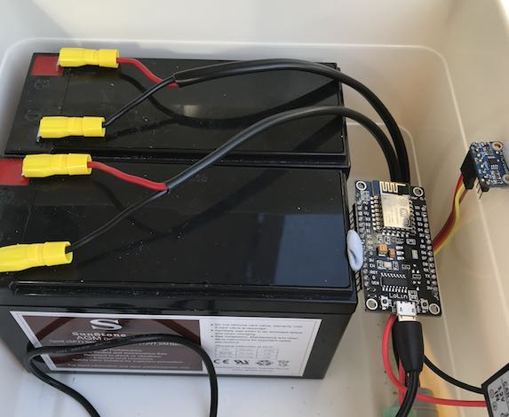

# Esp8266 WiFi Temperature Sensor

A basic sketch showing how to use the ESP8266 with the [Adafruit MCP9808][sensor] to log the ambient temperature to [thingspeak.com](https://thingspeak.com)

# Goals

The goal of this sketch is to report the ambient temperature to a remote/IOT server. As a bonus is it easy to also send the WiFi signal strength.

This sketch simply demonstrates basic WiFi and HTTP usage of the ESP8266 as well as a simple I2C sensor. The MCP9808 library is built for Arduino but works fine running on ESP8266.

# Outcomes

The micro-controller and sensor will report the ambient temperature of a small solar storage project. The live data generated from this sketch can be seen [here](https://thingspeak.com/channels/445104).

This is a rudimentary first pass of installing the sensor with blu-tack.

# Hardware

- [NodeMCU ESP8266 Dev Board](https://rover.ebay.com/rover/1/705-53470-19255-0/1?icep_id=114&ipn=icep&toolid=20004&campid=5338270079&mpre=https%3A%2F%2Fwww.ebay.com.au%2Fitm%2FNodeMcu-Lua-V3-WIFI-Networking-development-board-Based-ESP8266-IoT%2F181916585996)
- [Adafruit MCP9808 Temp Sensor][sensor]

# Prerequisites

- Arduino IDE with [ESP8266 Arduino Core][esp-core] installed
- [Adafruit MCP9808 Library](https://github.com/adafruit/Adafruit_MCP9808_Library) installed

# Setup

> Unfortunately this is not a tutorial, if you've already got your ESP8266 running from the Arduino IDE there's nothing much else you need to do to run this sketch.

- Get your IDE setup and running
- Install the Adafruit library, then install this library into your Arduino library directory
- Copy the included Settings.example.h to Settings.h and set your appropriate WiFi and Thingspeak settings.

# References

- [ESP8266 Arduino Core Docs][esp-core]
- [ESP8266 Arduino Core Wire.cpp Source](https://github.com/esp8266/Arduino/tree/master/libraries/Wire)
- [Thingspeak REST Api Docs](https://au.mathworks.com/help/thingspeak/rest-api.html)
- [NodeMCU Dev Kit](https://github.com/nodemcu/nodemcu-devkit-v1.0)
- [Thingspeak Wifi HTTP Example](https://github.com/nothans/thingspeak-esp-examples/blob/master/examples/RSSI_to_ThingSpeak.ino)
- [Thingspeak Arduino Library](https://github.com/mathworks/thingspeak-arduino)

[sensor]: https://www.adafruit.com/products/1782
[esp-core]: https://arduino-esp8266.readthedocs.io/en/latest/index.html
